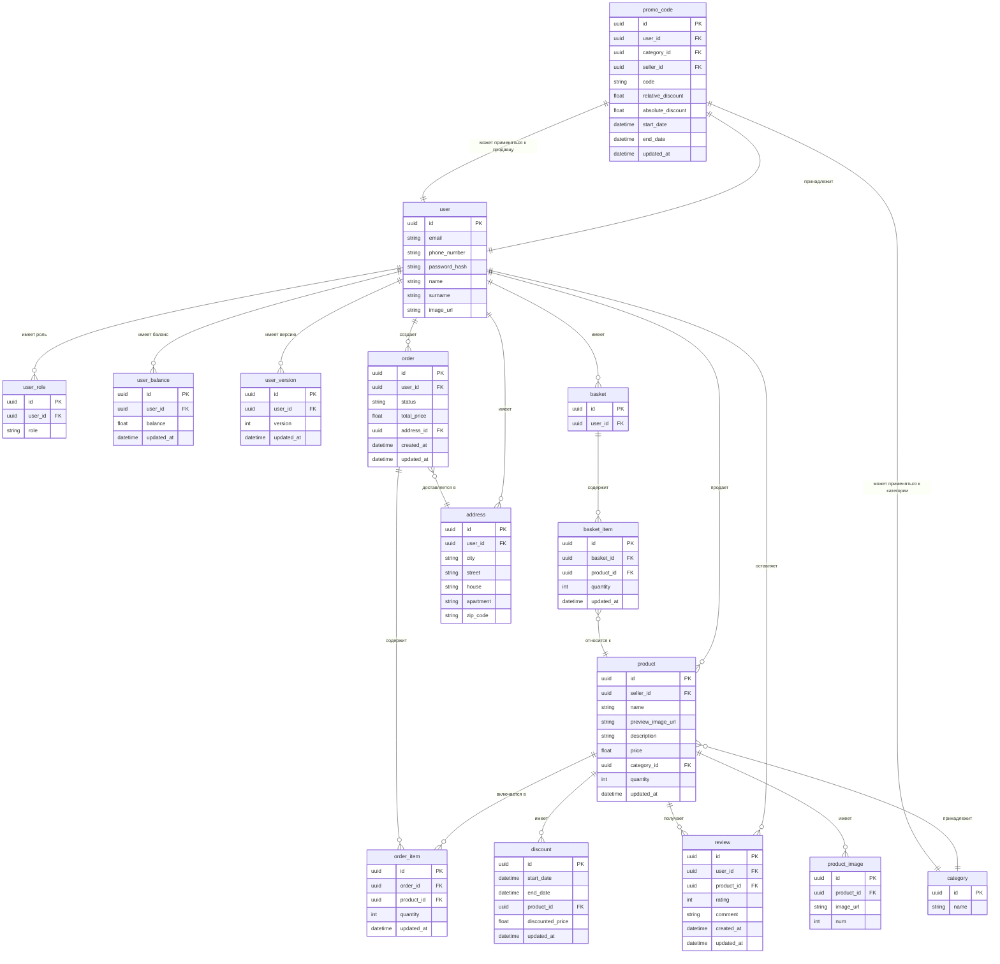

## Таблицы

### `user`
Хранит информацию о пользователях платформы.
- `id` — уникальный идентификатор
- `email` — почта пользователя
- `phone_number` — номер телефона
- `password_hash` — хеш пароля
- `name` — имя пользователя
- `surname` — фамилия пользователя
- `image_url` — ссылка на изображение профиля

### `user_role`
Хранит информацию о ролях пользователей.
- `id` — уникальный идентификатор
- `user_id` — идентификатор пользователя
- `role` — роль пользователя

### `user_balance`
Хранит баланс пользователей.
- `id` — уникальный идентификатор
- `user_id` — идентификатор пользователя
- `balance` — текущий баланс
- `updated_at` — время последнего обновления

### `user_version`
Хранит версию сессии пользователя.
- `id` — уникальный идентификатор
- `user_id` — идентификатор пользователя
- `version` — версия сессии
- `updated_at` — время последнего обновления

### `product`
Содержит информацию о товарах.
- `id` — уникальный идентификатор
- `seller_id` — идентификатор продавца
- `name` — название товара
- `preview_image_url` — изображение товара
- `description` — описание товара
- `price` — цена
- `category_id` — категория товара
- `quantity` — количество товара в наличии
- `updated_at` — время последнего обновления

### `product_image`
Хранит изображения товаров.
- `id` — уникальный идентификатор
- `product_id` — идентификатор товара
- `image_url` — ссылка на изображение товара
- `num` — порядковый номер изображения

### `discount`
Содержит информацию о скидках на товары.
- `id` — уникальный идентификатор
- `start_date` — дата начала скидки
- `end_date` — дата окончания скидки
- `product_id` — товар, на который действует скидка
- `discounted_price` — цена со скидкой
- `updated_at` — время последнего обновления

### `promo_code`
Хранит информацию о промокодах.
- `id` — уникальный идентификатор
- `user_id` — идентификатор пользователя, который может воспользоваться промокодом
- `category_id` — идентификатор категории (если промокод на товары конкретной категории)
- `seller_id` — идентификатор продавца (если промокод на товары конкретного продавца)
- `code` — значение промокода
- `relative_discount` — скидка в процентах
- `absolute_discount` — скидка в абсолютном значении
- `start_date` — дата начала действия
- `end_date` — дата окончания действия
- `updated_at` — время последнего обновления

### `category`
Хранит категории товаров.
- `id` — уникальный идентификатор
- `name` — название категории

### `order`
Хранит информацию о заказах.
- `id` — уникальный идентификатор
- `user_id` — пользователь, сделавший заказ
- `status` — статус
- `total_price` — общая сумма заказа
- `address_id` — адрес доставки
- `created_at` — дата создания заказа
- `updated_at` — время последнего обновления

### `order_item`
Связывает заказы с товарами.
- `id` — уникальный идентификатор
- `order_id` — идентификатор заказа
- `product_id` — идентификатор товара
- `quantity` — количество товара в заказе
- `updated_at` — время последнего обновления

### `basket`
Корзина пользователя.
- `id` — уникальный идентификатор
- `user_id` — идентификатор владельца корзины

### `basket_item`
Связывает товары с корзиной пользователя.
- `id` — уникальный идентификатор
- `basket_id` — идентификатор корзины
- `product_id` — идентификатор товара
- `quantity` — количество товара в корзине
- `updated_at` — время последнего обновления

### `review`
Хранит отзывы пользователей о товарах.
- `id` — уникальный идентификатор
- `user_id` — идентификатор пользователя, оставившего отзыв
- `product_id` — идентификатор товара
- `rating` — оценка товара
- `comment` — комментарий пользователя
- `created_at` — дата отзыва
- `updated_at` — время последнего обновления

### `address`
Хранит адреса пользователей.
- `id` — уникальный идентификатор
- `user_id` — идентификатор владельца адреса
- `city` — город
- `street` — улица
- `house` — номер дома
- `apartment` — номер квартиры
- `zip_code` — почтовый индекс
---

## ER-диаграмма базы данных

