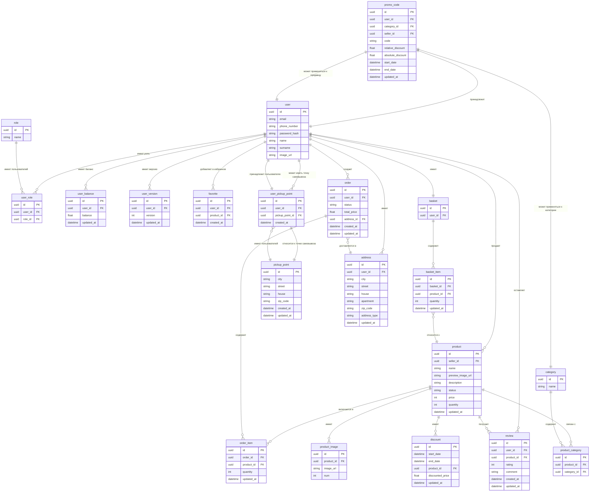

## Сущности

### `user`
Хранит информацию о пользователях платформы.
- `id` — уникальный идентификатор
- `email` — почта пользователя
- `phone_number` — номер телефона
- `password_hash` — хеш пароля
- `name` — имя пользователя
- `surname` — фамилия пользователя
- `image_url` — ссылка на изображение профиля

### `user_role`
Хранит информацию о ролях пользователей.
- `id` — уникальный идентификатор записи
- `user_id` — идентификатор пользователя
- `role_id` — идентификатор роли

### `role`
Хранит информацию о ролях.
- `id` — уникальный идентификатор
- `name` — название роли (например, `admin`, `seller`, `buyer`)

### `user_balance`
Хранит баланс пользователей.
- `id` — уникальный идентификатор
- `user_id` — идентификатор пользователя
- `balance` — текущий баланс
- `updated_at` — время последнего обновления

### `user_version`
Хранит версию сессии пользователя.
- `id` — уникальный идентификатор
- `user_id` — идентификатор пользователя
- `version` — версия сессии
- `updated_at` — время последнего обновления

### `product`
Содержит информацию о товарах.
- `id` — уникальный идентификатор
- `seller_id` — идентификатор продавца
- `name` — название товара
- `preview_image_url` — изображение товара
- `description` — описание товара
- `status` — статус товара (`pending` — ожидает одобрения, `approved` — одобрено)
- `price` — цена
- `quantity` — количество товара в наличии
- `updated_at` — время последнего обновления

### `product_category`
Связывает товары и категории, реализуя отношение «многие ко многим».
- `id` — уникальный идентификатор записи
- `product_id` — идентификатор товара
- `category_id` — идентификатор категории

### `favorite`
Хранит информацию о товарах, добавленных пользователями в избранное.
- `id` — уникальный идентификатор записи избранного
- `user_id` — идентификатор пользователя, добавившего товар в избранное
- `product_id` — идентификатор товара, добавленного в избранное
- `created_at` — дата и время добавления товара в избранное

### `product_image`
Хранит изображения товаров.
- `id` — уникальный идентификатор
- `product_id` — идентификатор товара
- `image_url` — ссылка на изображение товара
- `num` — порядковый номер изображения

### `discount`
Содержит информацию о скидках на товары.
- `id` — уникальный идентификатор
- `start_date` — дата начала скидки
- `end_date` — дата окончания скидки
- `product_id` — товар, на который действует скидка
- `discounted_price` — цена со скидкой
- `updated_at` — время последнего обновления

### `promo_code`
Хранит информацию о промокодах.
- `id` — уникальный идентификатор
- `user_id` — идентификатор пользователя, который может воспользоваться промокодом
- `category_id` — идентификатор категории (если промокод на товары конкретной категории)
- `seller_id` — идентификатор продавца (если промокод на товары конкретного продавца)
- `code` — значение промокода
- `relative_discount` — скидка в процентах
- `absolute_discount` — скидка в абсолютном значении
- `start_date` — дата начала действия
- `end_date` — дата окончания действия
- `updated_at` — время последнего обновления

### `category`
Хранит категории товаров.
- `id` — уникальный идентификатор
- `name` — название категории

### `order`
Хранит информацию о заказах.
- `id` — уникальный идентификатор
- `user_id` — пользователь, сделавший заказ
- `status` — статус
- `total_price` — общая сумма заказа
- `address_id` — адрес доставки
- `created_at` — дата создания заказа
- `updated_at` — время последнего обновления

### `order_item`
Связывает заказы с товарами.
- `id` — уникальный идентификатор
- `order_id` — идентификатор заказа
- `product_id` — идентификатор товара
- `quantity` — количество товара в заказе
- `updated_at` — время последнего обновления

### `basket`
Корзина пользователя.
- `id` — уникальный идентификатор
- `user_id` — идентификатор владельца корзины

### `basket_item`
Связывает товары с корзиной пользователя.
- `id` — уникальный идентификатор
- `basket_id` — идентификатор корзины
- `product_id` — идентификатор товара
- `quantity` — количество товара в корзине
- `updated_at` — время последнего обновления

### `review`
Хранит отзывы пользователей о товарах.
- `id` — уникальный идентификатор
- `user_id` — идентификатор пользователя, оставившего отзыв
- `product_id` — идентификатор товара
- `rating` — оценка товара
- `comment` — комментарий пользователя
- `created_at` — дата отзыва
- `updated_at` — время последнего обновления

### `pickup_point`
Таблица для ПВЗ (пунктов выдачи заказов).
- `id` — уникальный идентификатор ПВЗ
- `city` — город, в котором находится ПВЗ
- `street` — улица, на которой расположен ПВЗ
- `house` — номер дома, в котором находится ПВЗ
- `zip_code` — почтовый индекс ПВЗ
- `created_at` — дата и время создания записи
- `updated_at` — дата и время последнего обновления записи

### `user_pickup_point`
Связующая таблица для связи пользователей с пунктами выдачи заказов (ПВЗ).
- `id` — уникальный идентификатор записи
- `user_id` — идентификатор пользователя, связанного с ПВЗ
- `pickup_point_id` — идентификатор ПВЗ, с которым связан пользователь
- `created_at` — дата и время создания записи

### `address`
Таблица для хранения адресов пользователей.
- `id` — уникальный идентификатор адреса
- `user_id` — идентификатор владельца адреса (пользователя)
- `city` — город
- `street` — улица
- `house` — номер дома
- `apartment` — номер квартиры
- `zip_code` — почтовый индекс
- `address_type` — тип адреса (может быть `user` для адреса пользователя или `pickup` для адреса ПВЗ)
- `updated_at` — дата и время последнего обновления записи

---

## Функциональные зависимости и нормальные формы

### user
`{id} → {email, phone_number, password_hash, name, surname, image_url}`  
**1NF**: Все атрибуты атомарны, нет повторяющихся групп.  
**2NF**: Нет частичных зависимостей, так как первичный ключ состоит из одного атрибута.  
**3NF**: Нет транзитивных зависимостей, все неключевые атрибуты зависят только от первичного ключа.  
**NFBC**: Соответствует, так как детерминант (id) является ключом.

### user_role // FIXME: теперь две таблицы, т.к. связь многие ко многим
`{id} → {user_id, role}`  
Все нормальные формы соблюдаются аналогично отношению user.

### user_balance
`{id} → {user_id, balance, updated_at}`  
Все нормальные формы соблюдаются.

### user_version
`{id} → {user_id, version, updated_at}`  
Все нормальные формы соблюдаются.

### product
`{id} → {seller_id, name, preview_image_url, description, status, price, quantity, updated_at}`  
Все нормальные формы соблюдаются.

### favorite
`{id} → {user_id, product_id, created_at}`  
Все нормальные формы соблюдаются.

### product_image
`{id} → {product_id, image_url, num}`  
Все нормальные формы соблюдаются.

### discount
`{id} → {start_date, end_date, product_id, discounted_price, updated_at}`  
Все нормальные формы соблюдаются.

### promo_code
`{id} → {user_id, category_id, seller_id, code, relative_discount, absolute_discount, start_date, end_date, updated_at}`  
Все нормальные формы соблюдаются.

### category
`{id} → {name}`  
Все нормальные формы соблюдаются.

### product_category
`{id} → {product_id, category_id}`  
Все нормальные формы соблюдаются.

### order
`{id} → {user_id, status, total_price, address_id, created_at, updated_at}`  
Все нормальные формы соблюдаются.

### order_item
`{id} → {order_id, product_id, quantity, updated_at}`  
Все нормальные формы соблюдаются.

### basket
`{id} → {user_id}`  
Все нормальные формы соблюдаются.

### basket_item
`{id} → {basket_id, product_id, quantity, updated_at}`  
Все нормальные формы соблюдаются.

### review
`{id} → {user_id, product_id, rating, comment, created_at, updated_at}`  
Все нормальные формы соблюдаются.

### address //FIXME: обновить и добавить зависимости для таблиц с пвз 
`{id} → {user_id, city, street, house, apartment, zip_code}`  
Все нормальные формы соблюдаются.

## Общее заключение

Все отношения в схеме соответствуют:  
1. **1NF** - все атрибуты атомарны, нет повторяющихся групп  
2. **2NF** - нет частичных зависимостей (все PK состоят из одного атрибута)  
3. **3NF** - нет транзитивных зависимостей  
4. **NFBC** - все детерминанты являются потенциальными ключами  

Схема хорошо нормализована и не содержит аномалий вставки, обновления и удаления.

---

## ER-диаграмма базы данных

